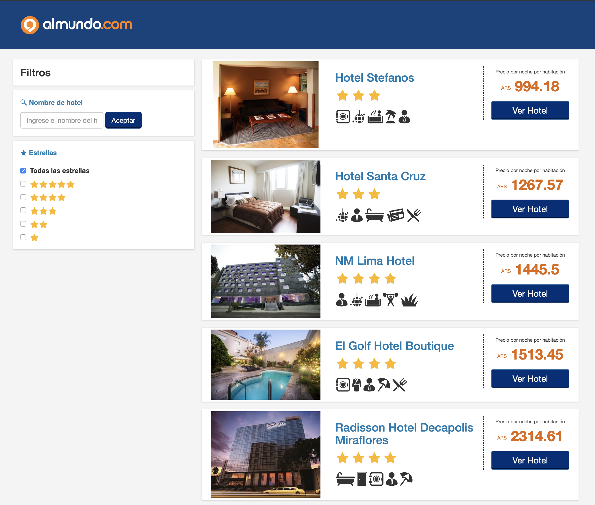
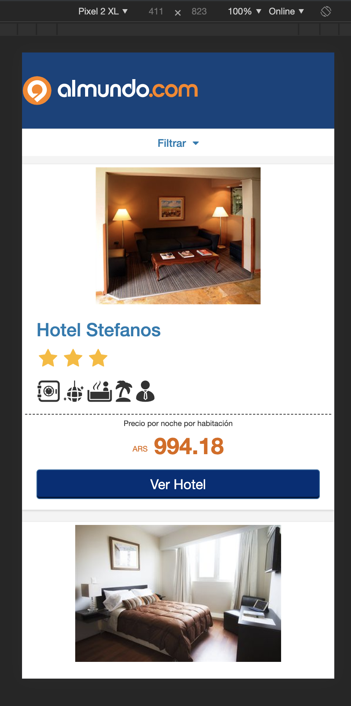

# almundo

This project was generated with the [Angular Full-Stack Generator](https://github.com/DaftMonk/generator-angular-fullstack) version 4.2.3.

## Getting Started

### Prerequisites

- [Git](https://git-scm.com/)
- [Node.js and npm](nodejs.org) Node = *4*.x.x, npm = 2.x.x
- [Gulp](http://gulpjs.com/) (`npm install --global gulp`)
- [MongoDB](https://www.mongodb.com/download-center#community) - If you plan on scaffolding your project with mongoose, you'll need mongoDB to be installed and have the `mongod` process running.
  * If you have [Docker](https://www.docker.com/) installed, you can easily run a test database with `docker run -p 27017:27017 --name afs-mongo -d mongo`

### Developing

1. Run `npm install` to install server dependencies.

2. Run `gulp serve` to start the development server. It should automatically open the client in your browser when ready.

3. Result

- Desktop

- Mobile

## Build & deploy

Run `gulp build` for building. Create 'dist' folder to deploy.

## Testing

Running `npm test` will run the unit tests with karma.
